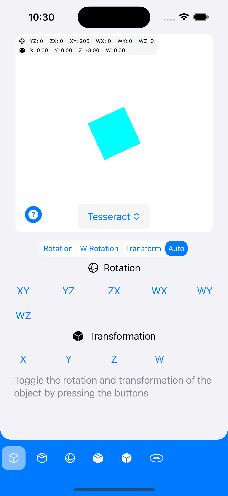

# Tesseract4D
An app which illustrates the way 4D objects cross our 3D plane. This uses ray-marching to determine the shape of the object which would cross our 3D space.

## How to install
Just open the .swiftpm file in XCode and run it on the simulator or an iPhone

## Screenshots

